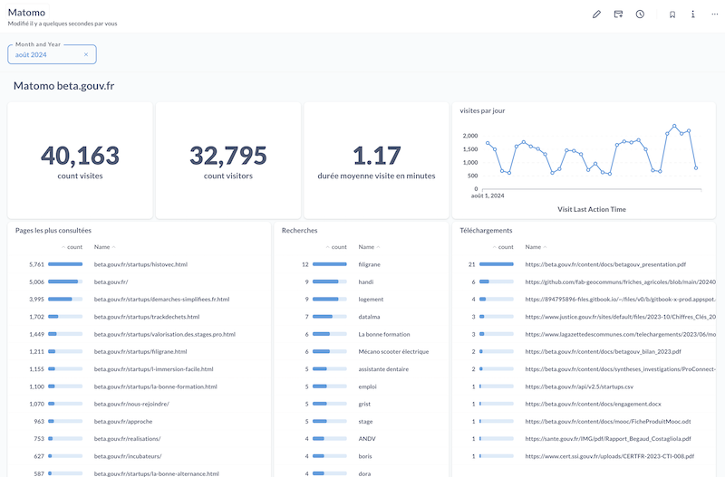

# matomo-to-pg

Dumps some matomo tables from MySQL to PostgreSQL.

For example to create custom metabase dashboards:

## Usage

Define:

- `SOURCE_DATABASE_URL`: The matomo MySQL source
- `TARGET_DATABASE_URL`: The PostgreSQL destination
- `SITE_ID`: The matomo site ID to import

Then run `npx matomo-to-pg`

## Dev

Run source with `node --env-file=.env index.mjs`

## references

- https://developer.matomo.org/guides/database-schema#log-data-persistence-visits
- http://www.sqlines.com/online
- https://matomo.org/faq/how-to/how-do-i-write-sql-queries-to-select-visitors-list-of-pageviews-searches-events-in-the-matomo-database/#sql-query-to-select-all-visits-and-actions-for-a-specific-website-id

## related

- https://github.com/SocialGouv/matomo-postgres
